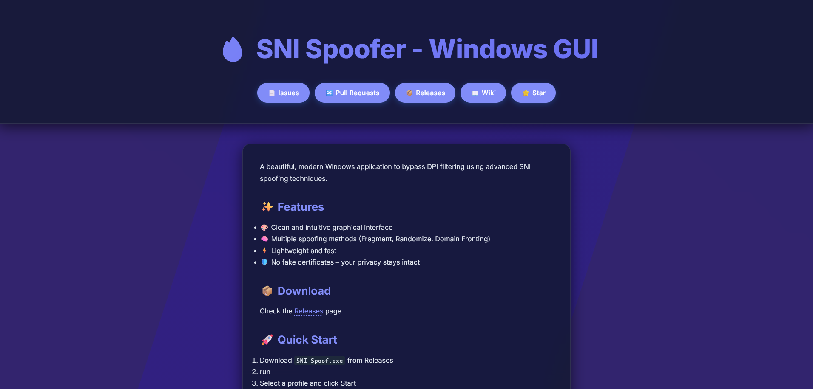
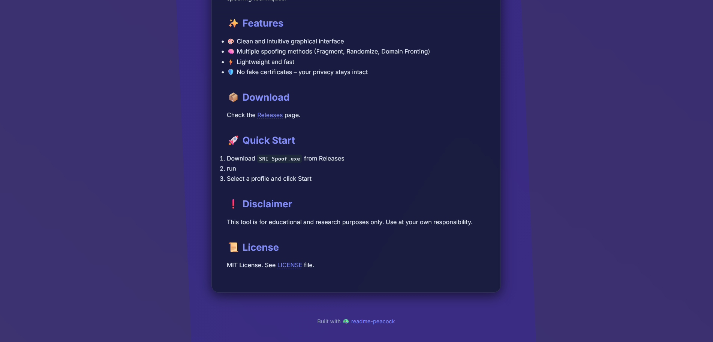

# 🦚 readme-peacock

**Turn your boring README.md into a stunning landing page — with a single command.**

  

## ✨ Why readme-peacock?

- 🖼️ **Beautiful out of the box** – Glassmorphism hero, animated gradient background, dark/light mode.
- ⚡ **Zero configuration** – Takes your `README.md` and outputs a ready‑to‑deploy `index.html`.
- 🧠 **Smart extraction** – Auto‑detects project title, shields.io badges, and repository links.
- 🔗 **GitHub quick links** – Add buttons for Issues, Pull Requests, Releases, Wiki and Star with `--repo`.
- 📦 **Single file** – Just `peacock.py`, nothing more. Easy to understand, easy to contribute.

## 📦 Installation

Make sure you have Python 3.8 or higher. Then install from PyPI:

pip install readme-peacock

Or install directly from the repository:

pip install git+https://github.com/ZvanTors/readme-peacock.git

## 🚀 Usage

### Basic

Run the following command in any directory containing a `README.md`:

peacock

This creates an `index.html` in the same folder. Open it with your browser — that’s your landing page.

### Custom paths and GitHub buttons

peacock README.md -o landing.html --repo "ZvanTors/readme-peacock"

This will:
- Read `README.md`
- Save the output to `landing.html`
- Add quick‑link buttons to your GitHub repository (Issues, Pull Requests, Releases, Wiki, Star)
- Replace your Repo and User

### Show help

peacock --help

## 🖌️ Features

- **Automatic dark/light mode** – Respects your OS theme.
- **Gradient background animation** – A smooth, living backdrop that never gets boring.
- **Badge extraction** – All `shields.io` badges from your README appear in the hero section.
- **Title handling** – The first `#` heading is moved to the hero, avoiding duplication.
- **Responsive design** – Looks great on mobile, tablet, and desktop.
- **No JavaScript API calls** – Static buttons that always work, even offline.

## 🖼️ Demo

> *A landing page generated from the very README you are reading.*

## 🚀 Live Demo

Check out the live landing page generated by readme-peacock itself:  
[https://zvanTors.github.io/readme-peacock](https://zvanTors.github.io/readme-peacock)

## 🤝 Contributing

I’d love your help! To contribute:

1. Fork the repo
2. Create your feature branch (`git checkout -b feature/amazing-idea`)
3. Commit your changes (`git commit -m 'Add amazing idea'`)
4. Push to the branch (`git push origin feature/amazing-idea`)
5. Open a Pull Request

Please make sure your code follows the existing style and that you test your changes.

## 📄 License

MIT © [ZvanTors](https://github.com/ZvanTors)

---

Made with 🦚 by [ZvanTors](https://github.com/ZvanTors)

---

## 🚀 GitHub Action

You can use readme-peacock as a GitHub Action to automatically build and deploy your landing page on every push.

1. Create a workflow file in your repository at .github/workflows/peacock.yml
2. Paste the following content into it:

name: Generate Landing Page
on:
  push:
    branches: [main]
  workflow_dispatch:

permissions:
  contents: read
  pages: write
  id-token: write

concurrency:
  group: "pages"
  cancel-in-progress: false

jobs:
  build:
    runs-on: ubuntu-latest
    environment:
      name: github-pages
      url: ${{ steps.deployment.outputs.page_url }}
    steps:
      - uses: ZvanTors/readme-peacock@v1
        with:
          repo: ${{ github.repository }}

3. Go to your repository Settings → Pages → Source and select "GitHub Actions".

4. Push to main and your landing page will be live at https://USERNAME.github.io/REPO