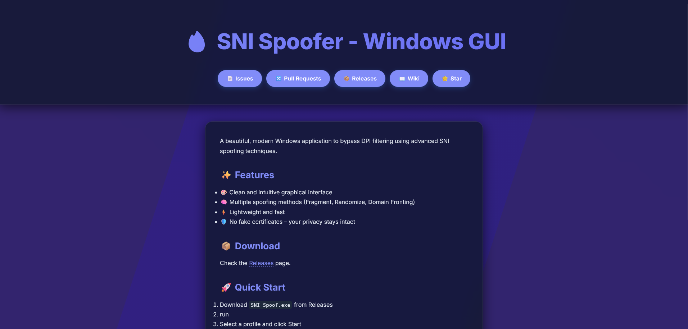
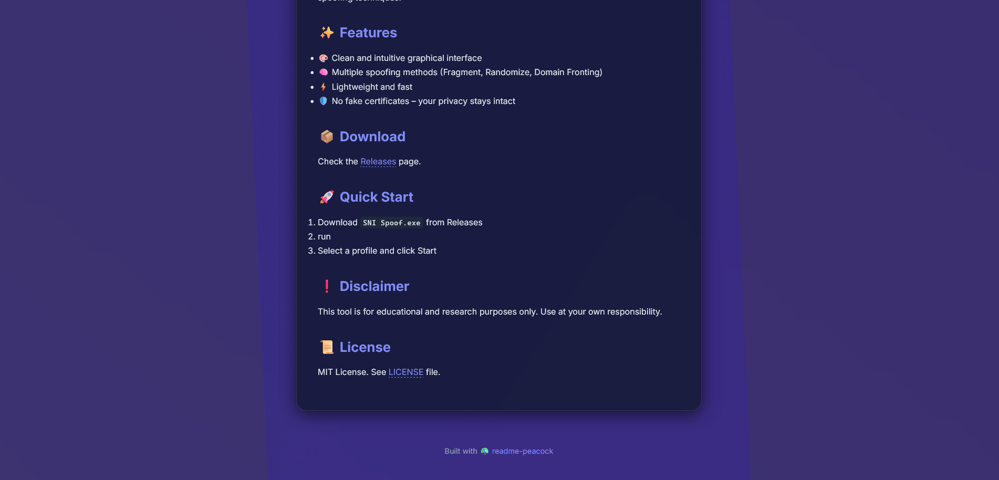

<h1>🦚 readme-peacock</h1>

<strong>Turn your boring <code>README.md</code> into a stunning landing page — with a single command.</strong>

<em>No configuration. No frameworks. Just run one command and deploy.</em>

 

 

---

<h2>📖 Table of Contents</h2>

<ul>
  <li><a href="#-about">🌟 About</a></li>
  <li><a href="#-why-readme-peacock">✨ Why readme-peacock?</a></li>
  <li><a href="#-installation">📦 Installation</a></li>
  <li><a href="#-usage">🚀 Usage</a></li>
  <li><a href="#-command-line-options">🎛 Command-Line Options</a></li>
  <li><a href="#-features">🖌 Features</a></li>
  <li><a href="#-screenshots">📸 Screenshots</a></li>
  <li><a href="#-live-demo">🌐 Live Demo</a></li>
  <li><a href="#-github-action">⚙️ GitHub Action</a></li>
  <li><a href="#-faq">❓ FAQ</a></li>
  <li><a href="#-contributing">🤝 Contributing</a></li>
  <li><a href="#-license">📄 License</a></li>
  <li><a href="#-credits">💖 Credits</a></li>
</ul>

---

<h2 id="-about">🌟 About</h2>

<strong>readme-peacock</strong> is a lightweight Python CLI that instantly converts your project's <code>README.md</code> into a beautiful, modern landing page.

Stop wasting hours building a website for every small project. Just run <code>peacock</code> — and get a production-ready <code>index.html</code> with a glassmorphism hero, animated gradient background, and one-click GitHub links.

<blockquote>

💡 <strong>Best part:</strong> it works offline, produces a single static HTML file, and deploys anywhere — GitHub Pages, Vercel, Netlify, or your own server.

</blockquote>

---

<h2 id="-why-readme-peacock">✨ Why readme-peacock?</h2>

<table>
  <thead>
    <tr>
      <th>Feature</th>
      <th>Description</th>
    </tr>
  </thead>
  <tbody>
    <tr><td>🖼 <strong>Beautiful out of the box</strong></td><td>Glassmorphism hero, animated gradient background, dark/light mode</td></tr>
    <tr><td>⚡ <strong>Zero configuration</strong></td><td>Takes your <code>README.md</code> and outputs a ready-to-deploy <code>index.html</code></td></tr>
    <tr><td>🧠 <strong>Smart extraction</strong></td><td>Auto-detects project title, shields.io badges, and repository links</td></tr>
    <tr><td>🔗 <strong>GitHub quick links</strong></td><td>Add buttons for Issues, Pull Requests, Releases, Wiki and Star with <code>--repo</code></td></tr>
    <tr><td>📂 <strong>Multiple files</strong></td><td>Process all Markdown files in a folder with <code>--all</code></td></tr>
    <tr><td>🎨 <strong>Themes</strong></td><td>Choose between <code>glass</code> (default) and <code>dark</code> themes via <code>--template</code></td></tr>
  </tbody>
</table>

---

<h2 id="-installation">📦 Installation</h2>

Make sure you have <strong>Python 3.8 or higher</strong>.

<strong>Install from PyPI:</strong>

<pre><code>pip install readme-peacock</code></pre>

<strong>Or install directly from the repository:</strong>

<pre><code>pip install git+https://github.com/ZvanTors/readme-peacock.git</code></pre>

---

<h2 id="-usage">🚀 Usage</h2>

<h3>1️⃣ Basic (single file)</h3>

Run the following command in any directory containing a <code>README.md</code>:

<pre><code>peacock</code></pre>

This creates a <code>site/</code> folder with an <code>index.html</code> inside. Open it with your browser — that's your landing page.

<h3>2️⃣ Custom paths and GitHub buttons</h3>

<pre><code>peacock README.md -o landing.html --repo "ZvanTors/readme-peacock"</code></pre>

This will:

<ul>
  <li>Read <code>README.md</code></li>
  <li>Save the output to <code>landing.html</code></li>
  <li>Add quick-link buttons to your GitHub repository (Issues, Pull Requests, Releases, Wiki, Star)</li>
</ul>

<h3>3️⃣ Process all Markdown files in a directory</h3>

<pre><code>peacock --all</code></pre>

Scans the current directory for all <code>.md</code> files and generates matching HTML pages in the <code>site/</code> folder.

<code>README.md</code> becomes <code>index.html</code>; others keep their original names (e.g., <code>faq.md</code> → <code>faq.html</code>).

You can combine <code>--all</code> with <code>--repo</code> and <code>--template</code>:

<pre><code>peacock --all --repo "ZvanTors/readme-peacock" --template dark</code></pre>

<h3>4️⃣ Choose a theme</h3>

<pre><code>peacock --template dark</code></pre>

<table>
  <thead>
    <tr>
      <th>Theme</th>
      <th>Description</th>
    </tr>
  </thead>
  <tbody>
    <tr><td><code>glass</code></td><td>(default) Light/dark auto-switching glassmorphism design</td></tr>
    <tr><td><code>dark</code></td><td>Always dark, high-contrast style with orange accents</td></tr>
  </tbody>
</table>

<h3>5️⃣ Show help</h3>

<pre><code>peacock --help</code></pre>

---

<h2 id="-command-line-options">🎛 Command-Line Options</h2>

<table>
  <thead>
    <tr>
      <th>Option</th>
      <th>Description</th>
    </tr>
  </thead>
  <tbody>
    <tr><td><code>input</code></td><td>Path to the Markdown file (default: <code>README.md</code>)</td></tr>
    <tr><td><code>-o, --output</code></td><td>Output HTML file or directory (default: <code>site/index.html</code>)</td></tr>
    <tr><td><code>--repo</code></td><td>GitHub repository in <code>user/repo</code> format — adds quick-link buttons</td></tr>
    <tr><td><code>--template</code></td><td>Choose a theme: <code>glass</code> (default) or <code>dark</code></td></tr>
    <tr><td><code>--all</code></td><td>Process every <code>.md</code> file in the current directory</td></tr>
    <tr><td><code>--help</code></td><td>Show the help message</td></tr>
    <tr><td><code>--version</code></td><td>Display the tool version</td></tr>
  </tbody>
</table>

---

<h2 id="-features">🖌 Features</h2>

<ul>
  <li><strong>Automatic dark/light mode</strong> — Respects your OS theme (or forced dark with the <code>dark</code> template).</li>
  <li><strong>Gradient background animation</strong> — A smooth, living backdrop that never gets boring.</li>
  <li><strong>Badge extraction</strong> — All <code>shields.io</code> badges from your README appear in the hero section.</li>
  <li><strong>Title handling</strong> — The first <code>#</code> heading is moved to the hero, avoiding duplication.</li>
  <li><strong>Multi-file support</strong> — Convert all your Markdown files at once with <code>--all</code>.</li>
  <li><strong>Themes</strong> — Visual variety without losing the core design.</li>
  <li><strong>Responsive design</strong> — Looks great on mobile, tablet, and desktop.</li>
  <li><strong>No JavaScript API calls</strong> — Static buttons that always work, even offline.</li>
</ul>

---

<h2 id="-screenshots">📸 Screenshots</h2>

<h3>Light Theme</h3>

  

<h3>Dark Theme</h3>

---

<h2 id="-live-demo">🌐 Live Demo</h2>

Check out the live landing page generated by <strong>readme-peacock</strong> itself:

👉 <a href="https://zvanTors.github.io/readme-peacock">https://zvanTors.github.io/readme-peacock</a>

---

<h2 id="-github-action">⚙️ GitHub Action</h2>

You can use <strong>readme-peacock</strong> as a GitHub Action to automatically build and deploy your landing page on every push.

<strong>Step 1.</strong> Create a workflow file in your repository at <code>.github/workflows/peacock.yml</code>

<strong>Step 2.</strong> Paste the following content into it:

<pre><code>name: Generate Landing Page
on:
  push:
    branches: [main]
  workflow_dispatch:

permissions:
  contents: read
  pages: write
  id-token: write

concurrency:
  group: "pages"
  cancel-in-progress: false

jobs:
  build:
    runs-on: ubuntu-latest
    environment:
      name: github-pages
      url: ${{ steps.deployment.outputs.page_url }}
    steps:
      - uses: ZvanTors/readme-peacock@v1
        with:
          repo: ${{ github.repository }}</code></pre>

<strong>Step 3.</strong> Go to your repository <strong>Settings → Pages → Source</strong> and select <strong>"GitHub Actions"</strong>.

<strong>Step 4.</strong> Push to <code>main</code> and your landing page will be live at <code>https://USERNAME.github.io/REPO</code>

Also available on the <a href="https://github.com/marketplace/actions/readme-peacock-landing-page-generator">GitHub Marketplace</a>.

---

<h2 id="-faq">❓ FAQ</h2>

<strong>Can I use my own custom CSS?</strong>

Currently you can manually edit the generated HTML. A <code>--css custom.css</code> option is planned for a future release.

<strong>Why are my images not showing in the output?</strong>

If your README references local images (e.g., <code>screenshot.png</code>), you need to copy those files next to the generated <code>index.html</code>. The tool does not automatically copy assets.

<strong>Can I deploy the output to Vercel or Netlify?</strong>

Absolutely. The output is a static HTML file and works on any static hosting service — GitHub Pages, Vercel, Netlify, Cloudflare Pages, or even a plain S3 bucket.

<strong>Does it work offline?</strong>

Yes. The tool has no runtime JavaScript API calls. All buttons and links are static HTML. The only online resources are the Google Fonts and shields.io badges, which are optional.

<strong>Can I process multiple Markdown files at once?</strong>

Yes — just use the <code>--all</code> flag. It will convert every <code>.md</code> file in the current folder and place the results inside the output directory.

---

<h2 id="-contributing">🤝 Contributing</h2>

Contributions, bug reports, and feature requests are welcome!

<ol>
  <li>Fork the repository</li>
  <li>Create a feature branch: <code>git checkout -b feature/amazing-feature</code></li>
  <li>Commit your changes: <code>git commit -m "Add amazing feature"</code></li>
  <li>Push to the branch: <code>git push origin feature/amazing-feature</code></li>
  <li>Open a <strong>Pull Request</strong></li>
</ol>

Please make sure your code follows the existing style and includes comments where necessary.

---

<h2 id="-license">📄 License</h2>

This project is licensed under the <strong>MIT License</strong> — see the <a href="LICENSE">LICENSE</a> file for details.

---

<h2 id="-credits">💖 Credits</h2>

<ul>
  <li><strong><a href="https://python-markdown.github.io/">Python-Markdown</a></strong> — the Markdown parsing engine.</li>
  <li><strong><a href="https://pages.github.com/">GitHub Pages</a></strong> — free static hosting for the live demo.</li>
  <li><strong><a href="https://shields.io/">shields.io</a></strong> — dynamic badge generation.</li>
  <li><strong>Made with ❤️ by <a href="https://github.com/ZvanTors">AmooReza (WhiteDNS)</a></strong></li>
</ul>

---

<h3>⭐ If this project helped you, please give it a star!</h3>

 

<strong>Turn your README into a landing page — instantly.</strong> 🦚

